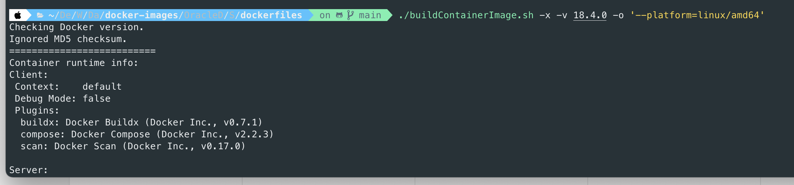
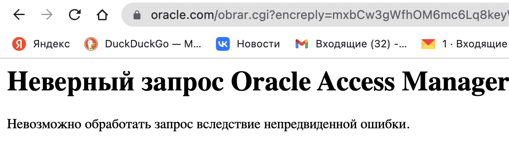

# hyundai_auto_ever

## Выполнение тестового задания для компании Hyundai AutoEver Corp

Необходимые файлы:
- [Задание](./Test%20task%20description.doc)  
- [Создание таблиц в БД](./tables_structures.sql)
- [Заполнение таблиц БД данными](./data_in_sql)
- [Выполнение работы(запросы)](./requests/rpm_requests.sql)

Для начала я попробовал работать с рекомендованной мне БД от Oracle, так само тестовое задание предполагает из себя её использование. Однако в работе с БД Oracle я столкнулся с некоторыми сложностями.

 - Чтобы запустить Oracle через Docker, необходимы определенные бинарные файлы, которые доступны только зарегистрированным пользователям.
 - При создании новой учетной записи Oracle, к сожалению, можно убедиться, что они более не позволяют указывать/заполнять данные пользователям из России :( 
 - Да и всё же зарегистрировавшись бывает, что что-то идёт не так (хотя, может, мне не повезло). В итоге спокойно достать бинарники мне не удалось. Протестировать free версию в облаке также не получилось ввиду информации профиля и платежных данных. 
 - Обойти проблему оказалось несложно. БД Oracle не так сильно отличается от того же Postgresql. Поменяв несколько параметров [(Varchar2 -> Varchar; Number -> Numeric)](https://habr.com/ru/post/335716/) я смог полноценно заняться выполнением тестового задания в БД Postgresql.
